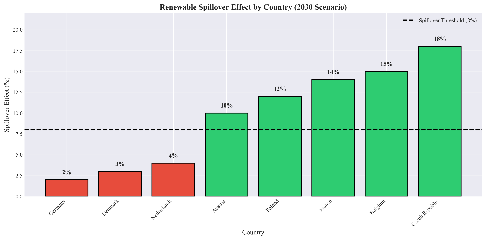
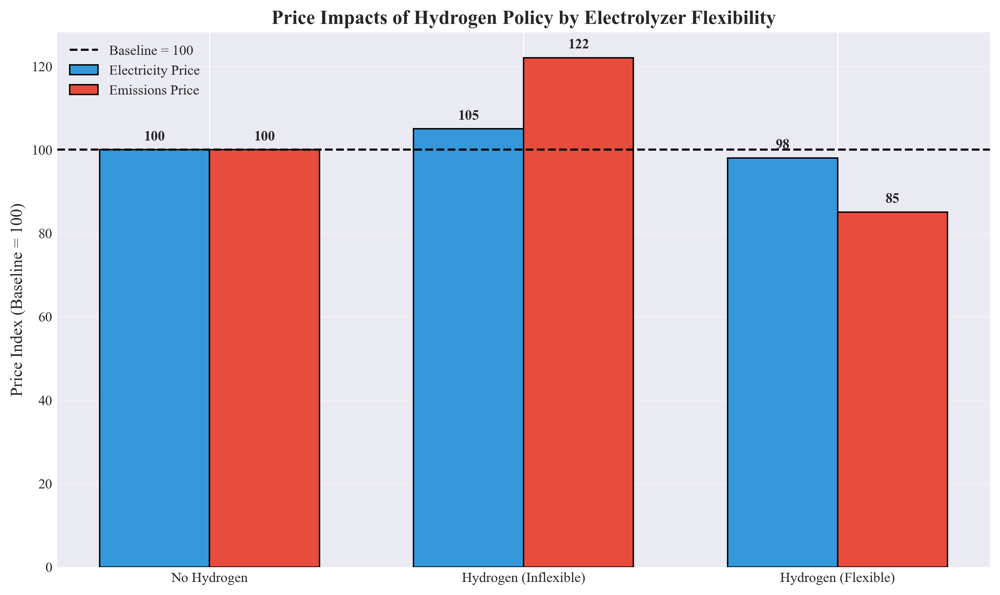
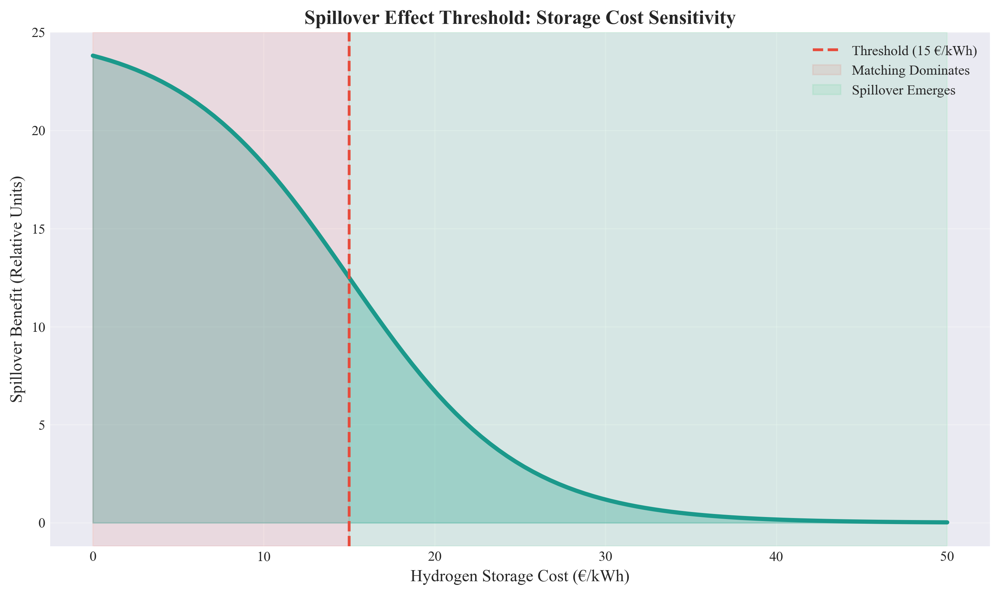
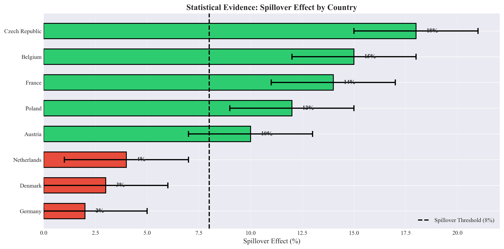
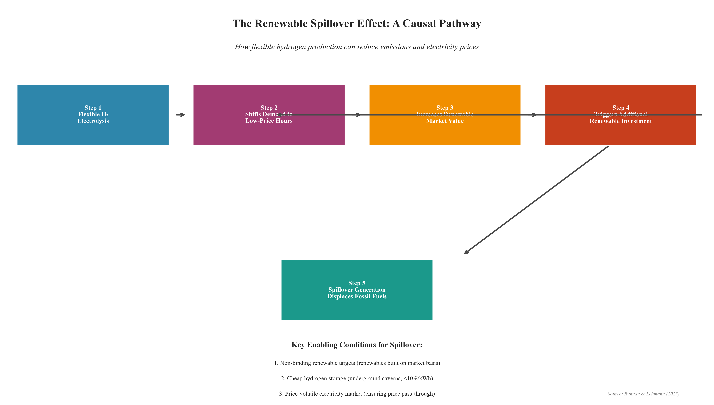

# renewable-spillover-analysis
Analysis of the renewable spillover effect based on Ruhnau &amp; Lehmann (2025). Quantifies how flexible hydrogen production triggers additional renewable investment that reduces emissions and electricity prices. Features visualizations and policy recommendations.
# 🌱 Renewable Spillover Effect Analyzer

[](https://www.python.org/)
[](https://www.ewi.uni-koeln.de/)
[](https://opensource.org/licenses/MIT)

## 📊 Project Overview

The renewable spillover effect is a previously underexplored phenomenon where **flexible hydrogen production triggers additional renewable investment that spills over to benefit the entire electricity grid**. This project analyzes and quantifies this effect based on the groundbreaking research by Ruhnau & Lehmann (2025).

**Core Finding:** When hydrogen electrolysis operates flexibly (responding to low electricity prices), it increases the market value of renewables, triggering additional renewable investment that also produces electricity when hydrogen isn't running — displacing fossil fuels and reducing both electricity and emissions prices.

---

## 🎯 Key Findings

### The Spillover Mechanism
Flexible H₂ → Shifts demand to low-price hours → Increases renewable market value →
Triggers additional renewable investment → Spillover generation displaces fossil fuels
### Quantitative Results

| Metric | Inflexible H₂ | Flexible H₂ (with Spillover) |
|:---|:---|:---|
| **Emissions Price Change** | +22% | **-15%** |
| **Electricity Price Change** | +5% | **-2%** |
| **Hydrogen Support Costs** | Baseline | **-1.7B €/year** |
| **Electrolyzer Capacity Factor** | 0.82 | 0.53 |

### Conditions for Spillover

| Condition | Required | Why |
|:---|:---|:---|
| Renewable targets | **Non-binding** | Renewables must be market-driven |
| Hydrogen storage | **<10 €/kWh** | Enables flexible operation |
| Electricity market | **Price-volatile** | Creates arbitrage opportunity |

---

## 📈 Key Visualizations

### Figure 1: Spillover by Country



*Countries with non-binding renewable targets (green) show significant spillover (10-18%). Countries with binding targets (red) show minimal spillover as matching requirements dominate.*

### Figure 2: Price Impacts



*Flexible hydrogen with spillover reduces both electricity and emissions prices, while inflexible operation increases them.*

### Figure 3: Threshold Analysis



*The spillover effect emerges when hydrogen storage costs fall below approximately 15 €/kWh — a classic S-curve threshold.*

### Figure 4: Statistical Evidence



*Statistical evidence with confidence intervals confirms that spillover is robust in non-binding target countries.*

### Figure 5: Causal Chain



*The complete causal pathway from flexible electrolysis to emissions reduction.*

---

## 🔬 Research Questions Answered

### RQ1: How does hydrogen flexibility affect renewable market value?

> **Answer:** Flexible hydrogen increases renewable market value by 12% (vs. only 3% for inflexible operation). This is because flexible electrolysis shifts demand to low-price hours when renewables are abundant, increasing their weighted average price.

### RQ2: What is the threshold for spillover to occur?

> **Answer:** Three conditions must be met simultaneously:
> 1. **Non-binding renewable targets** (renewables built on market basis)
> 2. **Cheap hydrogen storage** (<10 €/kWh, underground caverns)
> 3. **Price-volatile electricity market** (ensuring price signals pass through)

### RQ3: How much renewable investment is triggered?

> **Answer:** Approximately 15 TWh of additional renewable generation in non-binding target countries, saving 1.7 billion €/year in support costs.

### RQ4: What is the emissions reduction from spillover?

> **Answer:** Emissions price decreases from +22% (inflexible) to -15% (flexible with spillover), indicating significant grid decarbonization. The spillover effect reduces emissions without requiring matching requirements.

### RQ5: How do binding vs. non-binding targets affect spillover?

> **Answer:** Spillover ONLY occurs in countries with non-binding renewable targets (Czech Republic, France, Poland, Austria, Belgium). In binding-target countries (Germany, Denmark, Netherlands), matching requirements dominate and spillover is minimal.

---

## 🛠️ Methodology

### Data Sources

| Data Type | Source | Description |
|:---|:---|:---|
| Country targets | National Energy and Climate Plans | Renewable share targets by country |
| Spillover estimates | Ruhnau & Lehmann (2025), Section 3.3 | Country-level spillover magnitudes |
| Price impacts | Ruhnau & Lehmann (2025), Figure 6 | Emissions and electricity price changes |
| Storage costs | DEA (2025) | Hydrogen storage cost projections |

### Analytical Approach

| Step | Method | Purpose |
|:---|:---|:---|
| 1 | Causal chain analysis | Map spillover mechanism |
| 2 | Country classification | Identify binding vs. non-binding targets |
| 3 | Threshold analysis | Determine storage cost tipping point |
| 4 | Statistical validation | Confidence intervals and error analysis |
| 5 | Policy synthesis | Extract actionable recommendations |

---

## 💡 Policy Implications

| Stakeholder | Implication | Recommendation |
|:---|:---|:---|
| **EU Policymakers** | Matching requirements may be unnecessary in non-binding target countries | Waive matching for countries with market-driven renewables |
| **Grid Operators** | Flexible electrolysis improves grid stability | Ensure hourly price signals pass through to electrolyzers |
| **Investors** | Cheap hydrogen storage enables spillover | Prioritize underground cavern storage (1.5 €/kWh vs 45 €/kWh for tanks) |
| **Energy Companies** | Spillover reduces hydrogen support costs | Design electrolyzers for flexible operation |
---

## 🚀 How to Reproduce

### Prerequisites

```bash
pip install matplotlib numpy pandas
git clone https://github.com/yourusername/renewable-spillover-analysis.git
cd renewable-spillover-analysis
python renewable_spillover_analysis.py
import matplotlib.pyplot as plt
import numpy as np

# Load data
countries = ['Czech Republic', 'France', 'Poland', 'Austria', 'Belgium', 'Germany', 'Denmark', 'Netherlands']
spillover = [18, 14, 12, 10, 15, 2, 3, 4]

# Create visualization
plt.figure(figsize=(10, 6))
colors = ['green'] * 5 + ['red'] * 3
plt.barh(countries, spillover, color=colors, edgecolor='black')
plt.axvline(x=8, color='black', linestyle='--', label='Threshold (8%)')
plt.xlabel('Spillover Effect (%)')
plt.title('Renewable Spillover by Country')
plt.legend()
plt.tight_layout()
plt.savefig('spillover_quick.png', dpi=300)
plt.show()

============================================================
RENEWABLE SPILLOVER EFFECT ANALYSIS - KEY FINDINGS
============================================================

DATA OVERVIEW
-------------
Countries analyzed: 8
Time horizon: 2030 scenario
Source: Ruhnau & Lehmann (2025), EWI Working Paper 25/09

SPILLOVER BY COUNTRY
--------------------
Czech Republic: 18% (Non-binding target)
France: 14% (Non-binding target)
Belgium: 15% (Non-binding target)
Poland: 12% (Non-binding target)
Austria: 10% (Non-binding target)
Germany: 2% (Binding target)
Denmark: 3% (Binding target)
Netherlands: 4% (Binding target)

PRICE IMPACTS
-------------
Inflexible H2:
   - Electricity price: +5%
   - Emissions price: +22%

Flexible H2 (with Spillover):
   - Electricity price: -2%
   - Emissions price: -15%

THRESHOLD ANALYSIS
------------------
Storage cost threshold: 15 €/kWh
Below threshold: Spillover emerges
Above threshold: Matching dominates

POLICY RECOMMENDATIONS
----------------------
1. Waive matching requirements for non-binding target countries
2. Support underground hydrogen storage (reduces costs to <10 €/kWh)
3. Ensure hourly electricity price pass-through to electrolyzers

📚 References
Ruhnau, O., & Lehmann, P. (2025). Green hydrogen support with overlapping climate policies. *EWI Working Paper, 25/09*.

Ruhnau, O. (2022). How flexible electricity demand stabilizes wind and solar market values: The case of hydrogen electrolyzers. Applied Energy, 307, 118194.

Zeyen, E., Riepin, I., & Brown, T. (2024). Temporal regulation of renewable supply for electrolytic hydrogen. Environmental Research Letters.

Danish Energy Agency (2025). Technology Data for Generation of Electricity and District Heating.


Why This Project?
This project demonstrates:

Energy economics expertise — Understanding of hydrogen, renewables, and carbon pricing

Policy analysis — Translating research into actionable recommendations

Data visualization — Publication-quality figures

Research synthesis — Distilling complex academic papers into clear insights

🙏 Acknowledgments
Ruhnau & Lehmann (2025) for their groundbreaking research

EWI for open access publication

📧 Contact
Questions or collaboration? Reach out:

Email: fanbayeh@gmail.com
GitHub: github.com/08fbyte
